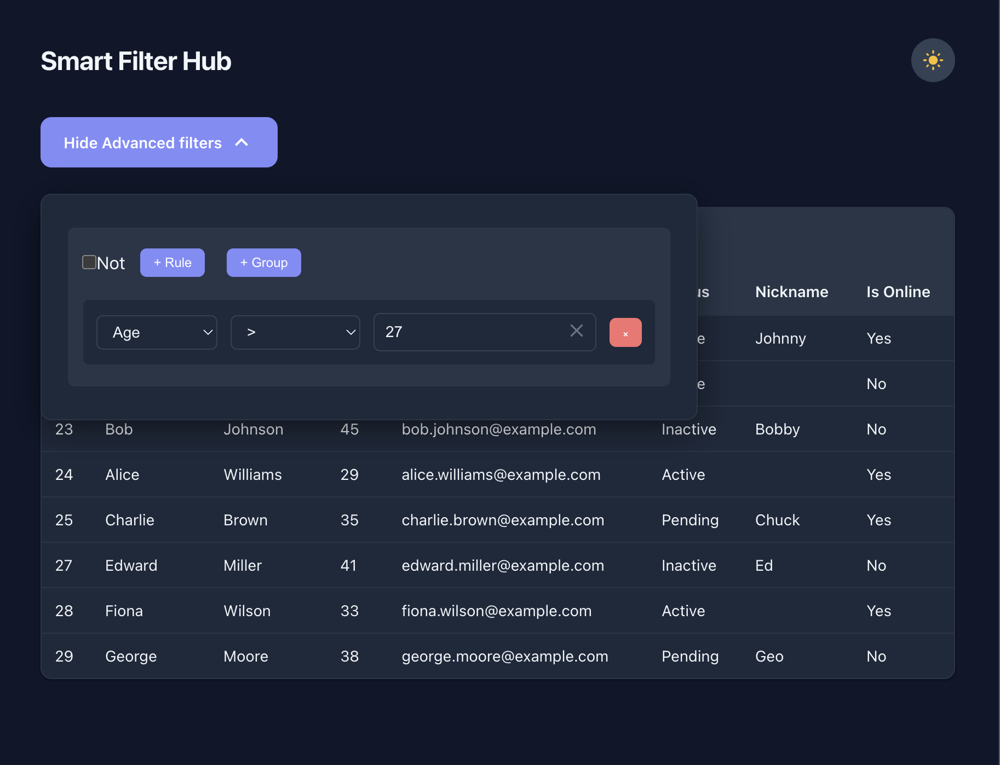

## Smart Filter Hub

A production-ready React application for dynamic data filtering, built on top of [React Query Builder](https://react-querybuilder.js.org/). It connects to a Spring Boot backend for live data and field definitions, with automatic fallback to local mock data when the API is unavailable.



### Features

- **Dynamic field definitions** — fields, operators, and types are fetched from the backend (`/api/variables`), not hardcoded
- **Autocomplete value editor** — type-ahead suggestions extracted from live data, with keyboard and mouse navigation
- **Type-aware validation** — field validators follow the RQB convention (`validator(rule)`); results are consumed via `props.validation` — no duplicate work
- **SQL injection protection** — cross-cutting sanitization rejects dangerous characters and patterns
- **Boolean / select / radio support** — fields like `isOnline` (radio) and `status` (select) use the library's built-in `ValueEditor`
- **Per-field operators** — each field declares its own operator set (string, number, email, boolean); no top-level `operators` prop needed
- **Collapsible filter panel** — toggle button shows the active rule count
- **Live results table** — filters data in real time as rules change, with full operator coverage including `between`, `doesNotContain`, etc.
- **Floating UI positioning** — suggestion list uses [`@floating-ui/react`](https://floating-ui.com/) for robust, viewport-aware positioning via portal
- **Graceful API fallback** — if the backend is unreachable, the app falls back to mock data with a one-time notification banner
- **Accessible** — ARIA attributes (`aria-expanded`, `aria-activedescendant`, `aria-controls`, `role="listbox"`) and full keyboard navigation

### Tech Stack

| Layer | Technology |
|---|---|
| UI Framework | React 18 |
| Query Builder | [react-querybuilder](https://react-querybuilder.js.org/) v7 |
| Positioning | [@floating-ui/react](https://floating-ui.com/) |
| Icons | [@mui/icons-material](https://mui.com/material-ui/material-icons/) |
| Styling | LESS with design tokens |
| Build Tool | Vite 5 |
| Backend | Spring Boot (separate repository) |
| Package Manager | pnpm |

### Setup

1. **Install dependencies**

```bash
pnpm install
```

2. **Start the backend** (optional — the app falls back to mock data if unavailable)

The Spring Boot backend should be running at `http://localhost:8080` with these endpoints:
- `GET /api/users` — user data
- `GET /api/variables` — field definitions (name, label, type, offset)

3. **Start the development server**

```bash
pnpm start
```

The app will be available at `http://localhost:5173` (or the port shown in the terminal).

### Environment Variables

The application uses Vite environment variables (prefixed with `VITE_`). These can be set in a `.env` file for local development or in your deployment platform (Netlify, Vercel, etc.).

| Name | Description | Default |
|------|-------------|---------|
| `VITE_API_BASE_URL` | Base URL for the backend API. Should include `/api` suffix if using proxy. | `/api` |
| `VITE_API_USERNAME` | HTTP Basic auth username for API requests. Leave blank to disable authentication. | *(none)* |
| `VITE_API_PASSWORD` | HTTP Basic auth password for API requests. | *(none)* |
| `VITE_APP_TITLE` | Text displayed in the header. | `Smart Filter Hub` |
| `VITE_BANNER_DURATION` | Milliseconds before the live/mock notification banner auto-dismisses. | `3000` |

In Netlify, define the variables under **Site settings → Build & deploy → Environment**. Do **not** commit a `.env` file containing secrets; configure them via the platform or local tooling.

> **Note:** the Netlify secrets scanner will ignore keys listed in the `SECRETS_SCAN_OMIT_KEYS` build variable. Add `VITE_API_USERNAME` and `VITE_API_PASSWORD` there if you prefer the scanner to skip them.


### Usage

1. On startup, a **notification banner** indicates whether the app is connected to the backend (green) or using mock data (orange). It auto-dismisses after 5 seconds.
2. Click the **"Advanced filters [X selected]"** button to expand the query builder panel.
3. Add rules using **"Add rule"** and **"Add group"** buttons.
4. For text fields, start typing to see **autocomplete suggestions**:
   - Use Arrow keys + Enter, or click a suggestion to select it.
   - A **clear button** (×) appears inside the input when it has a value.
5. **Validation feedback** appears inline — powered by RQB's built-in validation flow.
6. The **results table** automatically filters and displays matching records.
7. Use the **"not"** toggle on any group to negate its result.

Example filters to try:

- `age > 30` — users older than 30
- `status = Active` — only active users
- `email contains example` — filter by email domain
- `nickname null` — users without a nickname
- `isOnline = True` — only online users
- Combine multiple rules with AND/OR logic and nested groups

### Project Structure

```text
├── CollapsibleList.js                    # Page-level shell: data fetching, query state, fields
├── src/
│   ├── App.js                            # Top-level app component
│   ├── config/
│   │   └── queryConfig.js                # Field builder, operator sets, type mappings
│   ├── components/
│   │   ├── QueryBuilderController/       # Collapsible query builder (controlled mode)
│   │   ├── AutocompleteValueEditor/      # Custom value editor with autocomplete
│   │   │   ├── hooks/                    # useAutocompleteSuggestions, useInputValidation,
│   │   │   │                             # useSuggestionsPosition (Floating UI), useClickOutside,
│   │   │   │                             # useKeyboardNavigation, useSuggestionsState
│   │   │   └── subcomponents/            # InputWrapper, SuggestionsList, ValidationMessage
│   │   ├── CollapseButton/               # Expand/collapse toggle with MUI icons
│   │   ├── DataSourceBanner/             # One-time live/mock notification
│   │   └── ResultsTable/                 # Filtered results display
│   ├── data/
│   │   ├── mockData.js                   # Mock users (fallback)
│   │   └── mockVariables.js              # Mock field definitions (fallback)
│   ├── services/
│   │   └── userApi.js                    # API client (fetchUsers, fetchVariables)
│   ├── utils/
│   │   ├── queryFilter.js                # Client-side rule evaluation (all operators)
│   │   ├── fieldUtils.js                 # Field enhancement (suggestions + validator wiring)
│   │   ├── queryUtils.js                 # Helper utilities (rule counting)
│   │   └── validators/                   # Separated validation modules
│   │       ├── index.js                  # createFieldValidator composer
│   │       ├── sanitize.js               # SQL injection / dangerous char detection
│   │       ├── stringValidator.js        # String length checks
│   │       ├── numberValidator.js        # Number, non-negative, whole-number checks
│   │       └── emailValidator.js         # Email regex validation
│   └── styles/
│       ├── variables.less                # Design tokens (colors, spacing, z-index)
│       ├── App.less
│       ├── CollapsibleList.less
│       ├── AutocompleteValueEditor.less
│       ├── DataSourceBanner.less
│       ├── QueryBuilderController.less
│       ├── QueryBuilderController.query-builder.less
│       ├── CollapseButton.less
│       ├── ResultsTable.less
│       └── index.less                    # Global styles
├── package.json
└── vite.config.js
```

### Architecture Decisions

| Decision | Rationale |
|---|---|
| **Controlled query mode** | `CollapsibleList` owns the query state; `QueryBuilderController` is a pure presentational wrapper |
| **Per-field operators** | Each field declares its own operators via `field.operators` — no top-level `operators` prop or `getOperators` callback |
| **RQB validation flow** | Validators follow the `(rule) => result` signature; `AutocompleteValueEditor` reads `props.validation` instead of re-running the validator |
| **Floating UI for positioning** | Replaces manual `getBoundingClientRect` + `rAF` with a battle-tested positioning library; rendered via `createPortal` to avoid overflow clipping |
| **Separated validators** | Each type (string, number, email) has its own module; `sanitize.js` is a cross-cutting concern composed into all validators |
| **API fallback** | `try/catch` around `Promise.all` in `useEffect`; on failure, mock data is used seamlessly |

### Future Automated Test Ideas

- **Collapsible panel** — verify toggle, rule count label, click-outside dismissal
- **Autocomplete** — verify suggestions appear on typing, keyboard/mouse selection, clear button behavior
- **Suggestions positioning** — verify no clipping on scroll, portal renders correctly
- **Validation** — verify inline error messages for invalid inputs (SQL patterns, empty fields, negative numbers for unsigned types, invalid emails)
- **Operators** — verify all operators (`=`, `!=`, `<`, `>`, `contains`, `doesNotContain`, `beginsWith`, `doesNotBeginWith`, `endsWith`, `doesNotEndWith`, `between`, `notBetween`, `null`, `notNull`) filter correctly
- **Boolean/select fields** — verify radio buttons for boolean, dropdown for status, correct operator restrictions
- **NOT toggle** — verify negation works at any nesting level
- **API fallback** — verify banner shows "live" or "mock" depending on backend availability
- **Accessibility** — verify ARIA attributes, focus order, keyboard-only usage
